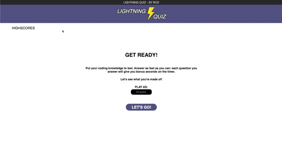

# Challenge-N4-LightningQuiz
Get ready! Answer as fast as your fingers can click!

## **ABOUT THE PROJECT**

The Lightning Quiz provides questions with a multiple answer mode, to test basic knowledge about JS, CSS and HTML.

* Each time a question is answered, the quiz will display animations; whether its right or wrong, stuff happens, and it will provide feedback.

* The local storage will always be updated with the last scores you've made.

 

The resources applied for this site are the following:

* For the HTML:
    * The classes and IDs are thoughtfully applied to make different states in the CSS.
    * data properties are assigned for further use.
* For the CSS:
    * Various states are made for the elements that need animations using classes.
    * :hover and transitions are used to animate elements across the site.
    * clases for unexisting elements in case they are created by the .js file.
* For JavaScript
    * HTML classes and ids are assigned to constants with intuitive names. 
    * Const, let and var declarations.
    * Objects
    * Arrays
    * Functions and methods
        * Arrow Functions.
        * Math.random (to sort arrays randomly or in decreasing order).
        * Functions for specific tasks to be called later by click events.
        * Event listeners are added and removed by loops and on demand.
        * Timeouts to give the user a smooth and intuitive experience.
        * .sort() to keep order or randomness.
        * HTML elements added in loops to render new elements that aren't there.
        * HTML classes are added and remove in various functions instead of altering elements' attributes.
## **USAGE**

The site is easy and intuitive to use, instruccions are placed when needed. The clickable and input elements reveal when you hover over to know with what you can interact.

Please provide a player name before you begin the game.
as soon as you click begin, you're against the clock, so be quick and star answering.

* The timer is challenging, and with only 10 initial seconds in the clock, you're forced to answer quick and correctly to gain more time on the clock.

* It's important to be right, but also to be fast, beware of the clock and be as quick as you can, because the bonus points are calculated by the time left on the clock.

* The bonus points have an exponential effect, and the faster and better your answers, your score will catapult to the max.

[Test your knowledge in coding now!](https://rod-freedom.github.io/Challenge-N4-LightningQuiz/)

## **CREDITS**

All the code was created from scratch by [Rod's Freedom (Rodrigo Lavalle).](https://github.com/Rod-Freedom)
